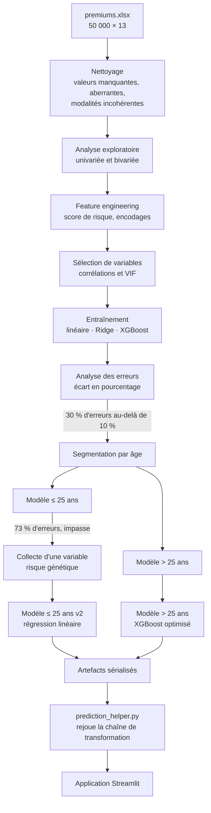

# Estimation de prime d'assurance santé

Outil de tarification pour souscripteurs : un formulaire, un montant de prime
annuelle estimé, et le comparatif des trois formules pour le même profil.
Derrière l'interface, deux modèles de régression choisis selon l'âge de
l'assuré.


---

## Le problème et la démarche

Un premier modèle entraîné sur l'ensemble des 50 000 assurés atteignait un R²
de 0,98 — chiffre flatteur qui masquait un défaut rédhibitoire : **30 % des
estimations s'écartaient de plus de 10 % du montant réel**. Pour un tarificateur,
cela signifie surfacturer ou sous-facturer près d'un client sur trois.

L'analyse des résidus a montré que ces erreurs se concentraient presque
entièrement sur les assurés de 25 ans et moins. D'où la démarche retenue :

| Étape | Résultat |
|---|---|
| Modèle unique, tous âges | R² 0,981 — **30 %** d'erreurs > 10 % |
| Segment > 25 ans isolé | R² 0,995 — problème résolu |
| Segment ≤ 25 ans isolé | R² 0,60 — **73 %** d'erreurs > 10 % |
| Ajout du facteur de risque génétique (≤ 25 ans) | R² 0,989 — **2,1 %** d'erreurs |

Le blocage sur la tranche jeune ne venait pas de l'algorithme mais des données :
aucune combinaison de modèles ne rattrapait l'absence d'une variable explicative.
Il a fallu retourner vers le métier pour faire collecter le facteur de risque
génétique. C'est cet ajout, et non un réglage d'hyperparamètres, qui a débloqué
le segment.

### Performances retenues

| Segment | Modèle | R² (test) | Estimations à moins de 10 % |
|---|---|---|---|
| ≤ 25 ans | Régression linéaire | 0,9887 | 97,9 % |
| > 25 ans | XGBoost | 0,9971 | 99,7 % |

Les deux objectifs du cahier des charges sont atteints : précision supérieure à
97 %, et au moins 95 % des écarts sous la barre des 10 %.

---

## Démarrage

```bash
pip install -r requirements.txt
```

```bash
streamlit run main.py
```

L'application s'ouvre sur `http://localhost:8501` et se compose de trois
onglets :

- **Tarification** — le formulaire et le résultat ;
- **Contexte et méthode** — la démarche de modélisation, les performances
  mesurées et les limites connues ;
- **Guide du souscripteur** — le glossaire des champs, la lecture du résultat
  et les cas où il vaut mieux repasser en instruction manuelle.

Les deux derniers onglets tiennent lieu de support de formation : un
souscripteur peut prendre l'outil en main sans documentation externe.

---

# Méthode

## Origine des données

Le jeu de données provient du projet pédagogique *healthcare premium prediction*
de [Codebasics](https://codebasics.io). Il simule le portefeuille d'un assureur
santé indien : **50 000 contrats, 13 variables**, une ligne par assuré.

| | |
|---|---|
| Volume | 50 000 lignes × 13 colonnes |
| Cible | `annual_premium_amount`, prime annuelle en roupies |
| Variables numériques | âge, personnes à charge, revenu en lakhs |
| Variables ordinales | niveau de revenu, formule souscrite |
| Variables nominales | genre, région, situation familiale, corpulence, tabagisme, statut professionnel |
| Variable composite | antécédents médicaux (une ou deux pathologies dans un même champ texte) |
| Variable ajoutée en cours de projet | facteur de risque génétique (0 à 5) |

Ce sont des données **synthétiques**, pas un export de production réel. Elles
reproduisent en revanche fidèlement les défauts d'un extract métier — valeurs
aberrantes, champs mal normalisés, valeurs manquantes — ce qui rend le travail
de nettoyage représentatif.

---

## Pipeline de traitement



Le point important de ce schéma est la **boucle de rétroaction** : l'analyse des
erreurs ne conclut pas le projet, elle le relance. C'est elle qui déclenche la
segmentation, puis la demande d'une nouvelle variable au métier.

---

## Nettoyage des données

| Problème constaté | Traitement | Effet |
|---|---|---|
| Noms de colonnes hétérogènes (espaces, casse) | Normalisation en `snake_case` | — |
| 26 valeurs manquantes sur 3 colonnes | Suppression des lignes | 50 000 → 49 976 |
| Doublons | Vérification, aucun trouvé | — |
| Personnes à charge négatives (`-3`, `-1`) | Valeur absolue — erreur de saisie, pas d'information perdue | — |
| Âges impossibles (`124`, `203`, `224`, `356`) | Filtrage au-delà de 100 ans | 49 976 → 49 918 |
| Revenus extrêmes | Seuil au 99,9ᵉ centile | 49 918 → 49 908 |
| Tabagisme : 6 modalités pour 3 réalités | Regroupement de `Not Smoking`, `Does Not Smoke` et `Smoking=0` sous `No Smoking` | — |

### Le choix de méthode sur les valeurs extrêmes

Le traitement des revenus mérite un mot, parce que la méthode par défaut donnait
un mauvais résultat. L'écart interquartile (IQR) fixait la borne haute à
**67 lakhs** et écartait **3 559 lignes**, soit plus de 7 % du jeu de données.

En les inspectant, il s'agissait très majoritairement de hauts revenus
parfaitement plausibles — pas d'erreurs de saisie. Les supprimer aurait appris
au modèle que cette clientèle n'existe pas.

La borne a donc été fixée au **99,9ᵉ centile**, soit 100 lakhs, ce qui n'écarte
que **10 lignes** véritablement aberrantes. Appliquer une règle statistique sans
vérifier ce qu'elle retire est le meilleur moyen de perdre du signal.

---

## Analyse exploratoire

| Objectif | Outil |
|---|---|
| Repérer les valeurs extrêmes | Boîtes à moustaches sur les variables numériques |
| Vérifier les distributions | Histogrammes avec estimation par noyau (KDE) |
| Mesurer les déséquilibres de classes | Diagrammes de fréquences relatives sur les 9 variables catégorielles |
| Chercher les relations à la cible | Nuages de points variable × prime |
| Croiser deux catégorielles | Tableau de contingence revenu × formule, en barres empilées puis en carte de chaleur |
| Détecter la redondance entre variables | Matrice de corrélation |

Le croisement revenu × formule est le plus parlant : les bas revenus se
concentrent massivement sur Bronze, les hauts revenus sur Gold. Le niveau de
revenu et la formule souscrite portent donc une information partiellement
redondante — ce que le calcul du VIF confirmera plus loin.

---

## Feature engineering

### Score de risque médical

La colonne `medical_history` contient du texte libre structuré : soit une
pathologie, soit deux séparées par `&` (`Diabetes & Heart disease`). Inutilisable
telle quelle, et l'encoder en variables indicatrices aurait produit neuf colonnes
sans traduire la **gravité relative** des pathologies.

La transformation retenue :

1. séparation du champ sur `&` en deux colonnes ;
2. attribution d'un poids de risque par pathologie, défini avec le métier —
   maladie cardiaque 8, diabète 6, hypertension 6, troubles thyroïdiens 5,
   aucune 0 ;
3. somme des deux poids ;
4. normalisation min-max sur `[0, 1]`, le maximum observé étant 14
   (hypertension + maladie cardiaque).

Neuf modalités textuelles deviennent **une seule variable continue et ordonnée**,
qui encode l'information de gravité au lieu de la perdre.

### Encodages

| Type | Variables | Méthode | Justification |
|---|---|---|---|
| Ordinal | `insurance_plan` (Bronze → 1, Silver → 2, Gold → 3)<br/>`income_level` (4 tranches → 1 à 4) | Correspondance manuelle | L'ordre porte du sens : une formule Gold couvre davantage qu'une Bronze |
| Nominal | genre, région, situation familiale, corpulence, tabagisme, statut professionnel | `get_dummies(drop_first=True)` | Aucun ordre naturel ; `drop_first` évite le piège des variables indicatrices |
| Mise à l'échelle | âge, personnes à charge, revenu, formule, risque génétique | `MinMaxScaler` | Ramène toutes les variables sur `[0, 1]`, indispensable pour comparer les coefficients de la régression linéaire |

Le `drop_first=True` mérite une note : sans lui, les modalités d'une même
variable somment à 1 et deviennent parfaitement colinéaires. La modalité retirée
sert de référence — ici *Femme*, *Nord-Est*, *Marié(e)*, *Normale*, *Non-fumeur*
et *Freelance*.

---

## Sélection de variables

Passage de 13 colonnes brutes à **17 variables explicatives** après encodage,
puis contrôle de la multicolinéarité par le **facteur d'inflation de la variance
(VIF)** :

| Variable | VIF initial | VIF après retrait |
|---|---|---|
| `income_level` | **12,45** | *retirée* |
| `income_lakhs` | **11,18** | 2,48 |
| `age` | 4,57 | 4,55 |
| `insurance_plan` | 3,58 | 3,45 |
| `normalized_risk_score` | 2,69 | 2,69 |

Deux variables dépassaient largement le seuil usuel de 5. C'était attendu :
`income_level` n'est qu'une version en tranches de `income_lakhs`. Retirer la
version discrétisée fait retomber l'ensemble sous 5, sans perte d'information
puisque la variable continue la contient déjà.

> Détail d'implémentation qui a des conséquences en production : le
> `MinMaxScaler` a été ajusté **avant** ce retrait. L'objet sérialisé attend donc
> toujours six colonnes, dont une que les modèles n'utilisent pas. Voir la
> section *Points techniques*.

---

## Entraînement et optimisation

Découpage 70 / 30 avec `random_state=10` pour garantir la reproductibilité.

| Modèle | R² | RMSE |
|---|---|---|
| Régression linéaire | 0,9281 *(test)* | 2 273 |
| Régression Ridge (α = 1) | 0,9281 *(test)* | 2 273 |
| XGBoost (20 arbres, profondeur 3) | 0,9782 *(test)* | 1 250 |
| XGBoost après optimisation | **0,9809** *(validation croisée)* | — |

La Ridge donne un résultat identique à la régression simple, ce qui indique
l'absence de surapprentissage à corriger — la pénalisation n'a rien à régulariser.

L'optimisation utilise `RandomizedSearchCV` (10 tirages, validation croisée à
3 plis, score R²) sur une grille de `n_estimators`, `learning_rate` et
`max_depth`. La recherche aléatoire plutôt qu'exhaustive : elle n'évalue que
10 combinaisons sur les 27 possibles, et atteint un résultat équivalent.

**Choix du modèle final par segment.** Sur les 25 ans et moins, la régression
linéaire (0,9887) devance légèrement XGBoost (0,9877). C'est elle qui est
retenue — à performance comparable, un modèle linéaire est plus rapide, plus
léger et surtout interprétable : ses coefficients se lisent directement comme
l'effet de chaque facteur sur la prime.

---

## Analyse des erreurs

C'est l'étape qui a orienté tout le projet, et elle repose sur une idée simple :
**le R² ne dit pas si un modèle est utilisable**.

Plutôt que de s'arrêter à la métrique globale, l'écart relatif a été calculé
dossier par dossier :

```python
residus_pct = (y_pred - y_test) / y_test * 100
```

Puis la part des dossiers dépassant le seuil métier de 10 % — 30 % du portefeuille,
dont 549 assurés mal estimés de **plus de 50 %**.

La recherche de la cause a procédé en trois temps :

1. **Isoler** le sous-ensemble des dossiers mal estimés.
2. **Comparer** la distribution de chaque variable sur ce sous-ensemble à celle
   du jeu de test complet, variable par variable, en superposant les
   histogrammes.
3. **Inverser la mise à l'échelle** (`scaler.inverse_transform`) pour relire les
   valeurs dans leur unité d'origine — sur des variables normalisées entre 0 et 1,
   le diagnostic n'est pas lisible.

Le résultat est sans ambiguïté : l'âge moyen du sous-ensemble mal estimé est de
**21,8 ans**, contre 34,4 ans sur l'ensemble. D'où la segmentation.

La même méthode, réappliquée au segment jeune après segmentation, n'a rien
trouvé : aucune variable disponible ne distinguait les dossiers mal estimés des
autres. C'est précisément ce résultat négatif qui a permis de conclure que
l'information manquante n'était pas dans le jeu de données — et de la demander.

---

## Du notebook à la production

Un modèle qui fonctionne dans un notebook ne fonctionne pas pour autant dans une
application. L'application doit **reconstituer à l'identique** la chaîne de
transformation, à partir de saisies brutes et sans pandas pour l'aider :
encodages, score de risque, ordre des colonnes, mise à l'échelle.

Une erreur à cette étape ne provoque aucun plantage — elle produit simplement des
prix faux. D'où un test de non-régression qui rejoue le pipeline applicatif
complet sur les jeux de test d'origine et le compare aux métriques des notebooks :

```bash
python tests/validate_pipeline.py
```

```
[young]  6026 lignes de test (attendu 6026)
  R2                        0.9887   (notebook 0.9887)
  erreurs > 10 %            2.14 % (notebook 2.14 %)
[rest]   8947 lignes de test (attendu 8947)
  R2                        0.9971   (notebook 0.9971)
  erreurs > 10 %            0.32 % (notebook 0.32 %)
```

Les métriques sont reproduites à la décimale : le prétraitement réimplémenté dans
l'application est donc identique à celui de l'entraînement.

---

## Compétences mobilisées

| Domaine | Mise en œuvre |
|---|---|
| Nettoyage | Valeurs manquantes, doublons, valeurs aberrantes (IQR puis centiles), harmonisation des modalités |
| Analyse exploratoire | Univariée, bivariée, tableaux de contingence, cartes de chaleur, matrice de corrélation |
| Feature engineering | Score composite pondéré, encodage ordinal, variables indicatrices, normalisation min-max |
| Statistiques | VIF et multicolinéarité, analyse des résidus, R², RMSE |
| Modélisation | Régression linéaire, Ridge, XGBoost, validation croisée, recherche aléatoire d'hyperparamètres |
| Diagnostic | Analyse d'erreurs par segment, comparaison de distributions, inversion de mise à l'échelle |
| Industrialisation | Sérialisation, reconstitution du pipeline, test de non-régression, application web |
| Communication | Documentation intégrée à l'outil, restitution destinée à un utilisateur non technique |

**Stack** — Python, pandas, NumPy, scikit-learn, XGBoost, statsmodels, Matplotlib,
Seaborn, Streamlit, Jupyter, Git.

---

## Structure

```
.
├── main.py                  Interface Streamlit (français)
├── prediction_helper.py     Prétraitement, mise à l'échelle, routage
├── content.py               Textes des onglets contexte et guide
├── assets/styles.css        Feuille de style
├── artifacts/               Modèles et scalers entraînés
├── notebooks/               Analyse exploratoire et entraînement
├── data/                    Jeux de données
└── tests/                   Validation du pipeline
```

### Les notebooks, dans l'ordre de lecture

| Fichier | Contenu |
|---|---|
| `ml_premium_prediction.ipynb` | EDA complète, feature engineering, premier modèle, analyse des erreurs |
| `data_segmentation.ipynb` | Découpage du jeu de données par tranche d'âge |
| `ml_premium_prediction_young.ipynb` | Segment ≤ 25 ans — l'impasse |
| `ml_premium_prediction_rest.ipynb` | Segment > 25 ans |
| `ml_premium_prediction_young_with_gr.ipynb` | Segment ≤ 25 ans après ajout du risque génétique |
| `ml_premium_prediction_rest_with_gr.ipynb` | Segment > 25 ans, modèle final exporté |

---

## Points techniques

**Le scaler attend une colonne que les modèles n'utilisent pas.** À
l'entraînement, `income_level` était mise à l'échelle avec les autres variables
numériques, puis retirée pour cause de multicolinéarité. Le scaler sérialisé en
garde la trace : `handle_scaling()` doit donc créer cette colonne avant d'appeler
`transform()`, puis la supprimer. L'omettre déclenche une erreur sur les noms de
variables attendus.

**L'ordre des colonnes est contraint.** XGBoost ne vérifie pas les noms au
moment de la prédiction : une permutation donnerait des montants faux sans la
moindre erreur. `EXPECTED_COLUMNS` fige cet ordre et `handle_scaling()` le
réapplique en sortie.

**Le score de risque médical est normalisé sur 14.** Le minimum et le maximum
observés à l'entraînement n'ont pas été sérialisés avec le modèle ; la borne
haute est donc codée en dur.

**Le risque génétique n'a aucun effet au-delà de 25 ans.** La variable a été
ajoutée au segment des plus de 25 ans avec une valeur nulle partout, uniquement
pour aligner le format d'entrée des deux modèles. L'interface le signale
explicitement plutôt que de laisser croire à une prise en compte.

**Format des artefacts.** Les modèles ont été entraînés sous scikit-learn 1.3.
Les objets scikit-learn se rechargent sans difficulté sous 1.7, mais le pickle
XGBoost déclenchait un avertissement de compatibilité et n'offre aucune garantie
entre versions majeures. Le modèle a donc été réexporté au format natif
(`model_rest.json`) ; la conversion a été vérifiée sur 2 000 tirages, écart
maximal nul. Le pickle d'origine est conservé à titre de référence.

---

## Limites

- Les montants sont exprimés en **roupies indiennes** et les revenus en lakhs
  (1 lakh = 100 000 ₹) : le modèle a été entraîné sur un portefeuille indien.
  Les libellés sont traduits, pas les ordres de grandeur.
- Les données sont **synthétiques**. Les performances mesurées valent pour ce
  jeu de données, pas pour un portefeuille réel.
- Le modèle des 25 ans et moins étant une régression linéaire, des saisies très
  éloignées des données d'entraînement peuvent produire un montant négatif.
  `predict()` ramène le résultat à zéro le cas échéant.
- Aucune ré-estimation périodique n'est prévue : les modèles reflètent le
  portefeuille au moment de leur entraînement.

---

## Licence

MIT.
